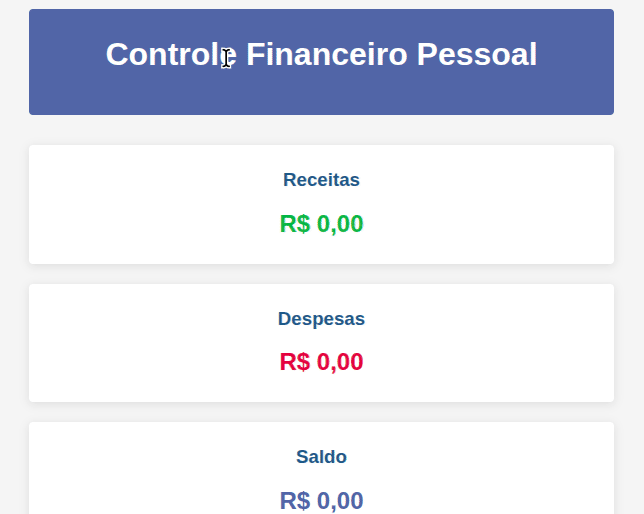

# Controle Financeiro Pessoal

Aplicação de controle financeiro pessoal desenvolvida com HTML, CSS e JavaScript.

## Funcionalidades

- Cadastro de transações (receitas e despesas)
- Categorização de transações
- Visualização de resumo financeiro
- Gráficos de receitas e despesas
- Filtros por período e categoria
- Exportação de dados para JSON

## Como usar

1. Clone o repositório ou faça download dos arquivos
2. Abra o arquivo `index.html` no navegador
3. Comece adicionando suas transações financeiras

## Estrutura de arquivos

- `index.html` - Página principal
- `styles/main.css` - Estilos da aplicação
- `scripts/main.js` - Ponto de entrada da aplicação
- `modules/` - Módulos da aplicação
  - `api.js` - Funções de acesso aos dados
  - `chart.js` - Manipulação de gráficos
  - `transactions.js` - Manipulação de transações
  - `ui.js` - Interface do usuário
